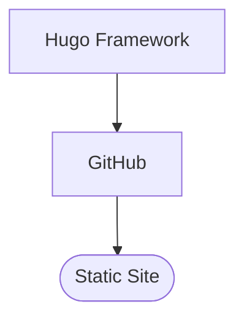

# Background
---
I built this site using the Hugo Framework for static site generation. There are two main components of the stack.
1. The Hugo Framework 
2. The GitHub repository and static page hosting

## 1. Hugo Framework
Hugo is a command-line tool for building static websites. It uses a strict file structure to convert plain text files to HTML. The tool builds the file structure with one command: `hugo new site genesis-middle-earth` That's it and you have the framework built

Hugo then will use the plain text markdown files and sub directories in `/content` file to populate the HTML pages.

### Structure of this Project
I built out content in line with the outline as shown below:
```
content/
  introduction/
    _index.md
    who-we-are.md
    what-is-christian-middle-earth.md
    methodology/
      _index.md
      hermeneutical-approach.md
      creation-evolution-debate.md
  chapters/
    chapter-01-creation-cosmic-temple/
      _index.md
      heptalogue.md
      waters-of-chaos.md
      the-spirit.md
      three-tier-dwelling-spaces.md
      filling-the-spaces/
        _index.md
        man-in-gods-image.md
        generous-host.md
      temple-dedication.md
      creation-as-exodus.md
    chapter-02-calling-and-vocation/
      _index.md
      every-temple-needs-a-priest.md
      trees-and-rivers.md
      every-priest-needs-an-ezer.md
    chapter-03-fall-the-first/
      ...
```

>[!NOTE]
>The upshot of all of this is that once the structure is all built, the content can easily be edited by simple writing text (and even rich content like images, audio, and video) into the markdown files in the content directory.
### Themes and Style
There are many per-built [themes](https://themes.gohugo.io/) that can be used to control the look and feel of the page without generating all the CSS by hand. I am using the [PaperMod](https://themes.gohugo.io/themes/hugo-papermod/) theme. The nice thing about the theme model is it just works and looks great with very little effort, but if you want to customize and aspect of the theme you can simply overwrite it with a `/assets/css/extended/custom.css` file. This allows for full customizability without requiring writing all the CSS from scratch. For example I changed the color scheme to a warmer color palette, and the font to Vollkorn, with just a few lines of CSS and the rest of the site style is controlled by the theme.
## 2. The GitHub Repository
Hugo builds all the HTML files and can host them as a localhost, but I am using GitHub as the web service to deploy the actual public facing https.

The Hugo part of the stack, once set-up, will require very little (if any) management. I can handle anything with that, and editing the site content requires no knowledge of what Hugo is doing.

>[!IMPORTANT]
>Understanding the basics of how to make collaborative changes to a the GitHub repository will be key for us to work on editing this website together. 

If you have ever done any development you will be familiar with Git for managing code repositories and GitHub for remotely syncing repositories across multiple machines and contributors. GitHub is the hub (pun intended) of nearly all open source code projects.

If you are not familiar with GitHub, you can think of it as Google Drive with a steeper learning curve and a lot more control of who makes what changes and how those changes get merged and handled in the cloud file system.

The repository of this site is at `https://github.com/JHulinator/genesis-middle-earth.git`

There are of course many online tutorials for learning how to work with GitHub. And the good thing is the system is resilient, as you can image it would have to be for large open source projects, so if you mess things up as you are learning it can be fixed without corrupting the project code base.

# Set-up
---
## 1. Create a GitHub Account
You can skip this if youhaveone already.
1. Go to: https://github.com
2. Click Sign Up.
3. Choose a username, email address, and password.
4. Verify your email address.
5. Send me your GitHub username so I can add you as a collaborator to this repo.
## 2. Install Git
You can skip this if you already have it. Check in the command line with: `git --version`
1. Go to: https://git-scm.com/downloads
2. Chose and operating system 
3. Accept the default installation options unless you have a reason to change them.
4. Verify successful install: `git --version`
## 3. Configure Git
Run the following commands, replacing the last term with our information:
```Shell
git config --global user.name "Your Name"  
git config --global user.email "your@email.com"
```
## 4. Clone the Repository
This makes a local copy to the code base on your machine and any changes you make will only be on your machine until they get merged back to the remote "cloud" repository.
1. Open the terminal and navigate to the directory where you want the files to live on our local machine.
2. Clone the repo
```Shell
git clone https://github.com/JHulinator/genesis-middle-earth.git
```

## 5. (Optional) Install VS Code
Though all git commands can be run from the terminal, an IDE like VS Code can make these super easy with the click of a button.

## 6. (Optional) Install Hugo
Though most of the Hugo is fully built, this can be helpful for verifying that everything you have changed is rendering correctly on a localhost before publishing broken links or bad formatting to the live website.

# Editing
---
Once you have done the initial set up above, this will be the basic workflow for making changes to the website.
## Editing Workflow
### 1. Get Update from Main
Before starting new work, it is best practice to always ensure that your local copy is up to date with the main cloud repo.
1. Switch to the main branch: `git checkout main`
2. Download latest version: `git pull`
### 2. Create a New Branch
For each new change you make you will need to do it first on a new branch so that it can be merged back with main (Changes are not made in main branch).
```Shell
git checkout -b your-branch-name
```

>[!NOTE]
>The -b flag creates a new branch if one does not exist with that name. You can use the same command to change the branch you are working on if multiple branches exist.
>Checkout and existing branch with:
>```Shell
>git checkout <branch-name>
>```
>
>Get a list of all existing braces with:
>```Shell
>git branch -a
>```

### 3. Make and Verify Changes
1. Make changes in your branch on your local machine by editing the `.md` files in the `/content` directory.
>[!NOTE]
>All the page content files use Markdown syntax. This is pretty simple markup language, but if you are not familiar, you should review what Markdown is.
2. Verify that these render correctly on localhost
	1. Serve the HTML locally
	```Shell
	hugo server -D
	```
	2. View and interact with the served page. Open a web browser on the same machine and go to `http://localhost:1313`
### 4. Commit Your Changes
1. Stage your changes: `git add --all`
2. Create a commit: `git commit -m "A comment describing what you changed goes here"`
### 5. Push to Remote
This pushes the changes that you have made on your machine to the cloud repository
```Shell
git push origin <your-branch-name>
```
### 6. Create a Pull Request
1. Go to the repository on GitHub.com
2. GitHub will usually display a **Compare & Pull Request** button.
3. Click it.
4. Enter a description of your changes.
5. Click **Create Pull Request**.
I will review the changes before merging them into the main branch.

## Editing Workflow Overview
```Shell
git checkout main
git pull

git checkout -b my-branch

# Edit files

git add .
git commit -m "Describe changes"

git push origin my-branch
```
- Open a pull request on GitHub.com
- Once I merge to main, changes will be live on the deployed web page.
>[!TIP]
>Run `git status` often. It's one of the most useful commands in Git and it's completely safe (it never changes anything, it just reports).
>
>It tells you:
>- Which branch you're currently on
>- Which files you've changed but haven't staged yet
>- Which files are staged and ready to commit
>- Whether your branch is ahead of, behind, or in sync with the remote
>
>A good habit is to run `git status` before and after almost every step in the workflow above (before adding, before committing, before pushing). If something looks unexpected — a file you didn't mean to change, or a branch you didn't mean to be on, then `git status` allows you to catch it before it becomes a problem.
## Basic Best Practices
- Do not commit directly to main.
- Create a new branch for every contribution.
- Keep pull requests focused on a single topic.
- Use clear commit messages.
- Ask questions if you're unsure about a change.